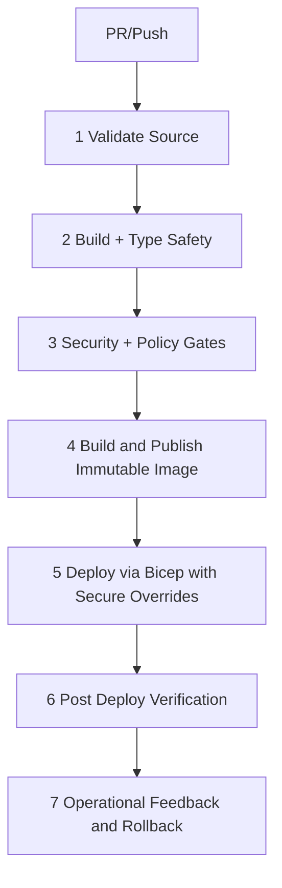

<!-- markdownlint-disable-file -->
# Task Research: Deployment CI/CD 7-Point Harness

Research and define a practical 7-point harness to manage deployment and automated CI/CD for the tile-fighter game monorepo.

## Task Implementation Requests

* Design a 7-point harness covering build, test, security, artifact, deployment, verification, and operations gates.
* Map recommendations to the current repository structure and tooling.
* Provide concrete implementation-ready examples (workflows, scripts, environment strategy).

## Scope and Success Criteria

* Scope: CI/CD and deployment architecture for the existing Node/TypeScript monorepo and Azure Container Apps Bicep deployment path.
* Assumptions:
  * The repository is the source of truth for build, test, and infra definitions.
  * CI/CD should be automatable with common hosted runners.
  * Deployment targets include environment-specific parameters already present in infra files.
* Success Criteria:
  * A complete 7-point harness with one recommended approach.
  * Evidence-backed mapping to existing files and scripts.
  * Implementation details sufficient for immediate execution by an implementor.

## Outline

1. Repository and pipeline baseline
2. Risks and gaps
3. Seven harness points
4. Technical scenario alternatives
5. Selected approach and rollout plan

## Potential Next Research

* Choose authoritative CI/CD platform (GitHub Actions vs Azure DevOps)
  * Reasoning: Job syntax, identity model, and environment approvals differ by platform.
  * Reference: no existing .github/workflows files in repository.
* Finalize migration command contract and documentation parity
  * Reasoning: Docs currently mention migrate:generate while scripts expose migrate:up/down.
  * Reference: README.md and apps/server/package.json.
* Confirm managed Container Apps environment bootstrap ownership
  * Reasoning: current Bicep consumes existing environment and does not create it.
  * Reference: apps/server/infra/containerapps/bicep/main.bicep.

## Research Executed

### File Analysis

* package.json
  * Root scripts and workspaces exist for baseline CI orchestration (lines 6-14).
* tsconfig.json
  * Project references define topological build graph (lines 3-18).
* apps/server/package.json
  * Server scripts include build, lint, test, load test, and migrations (lines 8-16).
* apps/server/vitest.config.ts
  * Server tests are configured for node runtime with shared package aliasing (lines 6-20).
* apps/server/docker/Dockerfile
  * Docker build currently references missing root file .eslintrc.cjs (line 5).
* apps/server/infra/containerapps/bicep/main.bicep
  * Container App probes and secret refs are defined; managed env is existing resource (lines 48-50, 65-162).
* apps/server/infra/containerapps/bicep/main.dev.bicepparam
  * Parameter file includes placeholder secure values and static dev image tag (lines 5-12).
* apps/server/infra/containerapps/bicep/main.prod.bicepparam
  * Parameter file includes placeholder secure values and static prod image tag (lines 5-12).
* apps/server/src/http/routes/health.routes.ts
  * Implements /healthz and /readyz used by infra probes (lines 7-14).
* apps/server/src/config/env.ts
  * Runtime accepts single/multi/both tenant modes, but deployment currently hardcodes single (lines 13-17).

### Code Search Results

* .github/workflows/*
  * No workflow files found.
* migrate:generate
  * Found in docs, not found in package scripts.
* TENANT_MODE
  * Runtime supports multiple values; Bicep env assignment is currently fixed.

### External Research

* Not required for this cycle.
  * Repository-local evidence was sufficient to define the harness architecture and implementation path.

### Project Conventions

* Standards referenced: Monorepo workspace scripts, TypeScript project references, Vitest test execution, Bicep parameterized deployment.
* Instructions followed: Task Researcher mode constraints and .copilot-tracking research file conventions.

## Key Discoveries

### Project Structure

* The repository is a Node/TypeScript monorepo with root-level script fan-out for lint/test and reference-based TypeScript build.
* Server app is the operational deployment unit and contains infra, Dockerfile, and live endpoints.
* Shared packages are consumed by server tests via source aliases.
* CI/CD is not codified yet in repository workflow files.

### Implementation Patterns

* Validation pattern: npm ci, npm run lint, npm run test, npm run build can run from root with existing scripts.
* Infra pattern: Bicep module deploys Container App into existing managed environment with secure parameter support.
* Health pattern: platform probes map to implemented health/readiness endpoints.
* Auth pattern: ENTRA_* values are deployment-critical for both HTTP and room join authentication.
* Release pattern gap: bicepparam files use static image tags; immutable artifact promotion is not yet in place.

### Complete Examples

```yaml
name: ci
on:
  pull_request:
    branches: [main]
jobs:
  validate:
    runs-on: ubuntu-latest
    steps:
      - uses: actions/checkout@v4
      - uses: actions/setup-node@v4
        with:
          node-version: 22
          cache: npm
      - run: npm ci
      - run: npm run lint
      - run: npm run test
      - run: npm run build
```

### API and Schema Documentation

* Container App inputs and secure params are defined in:
  * apps/server/infra/containerapps/bicep/main.bicep
* Environment-specific overrides are defined in:
  * apps/server/infra/containerapps/bicep/main.dev.bicepparam
  * apps/server/infra/containerapps/bicep/main.prod.bicepparam
* Probe contracts are defined in:
  * apps/server/src/http/routes/health.routes.ts

### Configuration Examples

```yaml
name: deploy-dev
on:
  push:
    branches: [main]
jobs:
  deploy:
    runs-on: ubuntu-latest
    environment: dev
    steps:
      - uses: actions/checkout@v4
      - run: az bicep build --file apps/server/infra/containerapps/bicep/main.bicep
      - run: |
          az deployment group create \
            --resource-group "${{ secrets.AZURE_RESOURCE_GROUP_DEV }}" \
            --template-file apps/server/infra/containerapps/bicep/main.bicep \
            --parameters @apps/server/infra/containerapps/bicep/main.dev.bicepparam \
            --parameters imageName="${{ secrets.ACR_LOGIN_SERVER }}/tile-fighter-server:${{ github.sha }}" \
            --parameters databaseUrl="${{ secrets.DATABASE_URL_DEV }}" \
            --parameters entraClientId="${{ secrets.ENTRA_CLIENT_ID_DEV }}" \
            --parameters entraTenantId="${{ secrets.ENTRA_TENANT_ID_DEV }}" \
            --parameters entraAudience="${{ secrets.ENTRA_AUDIENCE_DEV }}" \
            --parameters entraJwksUri="${{ secrets.ENTRA_JWKS_URI_DEV }}"
```

## Technical Scenarios

### End-to-End CI/CD Harness for Tile Fighter

Seven harness points were evaluated and mapped to repository capabilities: source validation, deterministic build, security gates, immutable artifact, environment-safe deployment, post-deploy verification, and operational feedback.

**Requirements:**

* Automated validation on every change
* Secure and repeatable environment deployments
* Progressive release confidence via post-deploy verification

**Preferred Approach:**

* One-pipeline, multi-stage harness with immutable artifact promotion and environment gates.
* Platform recommendation for this repo: GitHub Actions, because workflows are currently absent and repository-native automation is the shortest path to adopt.

```text
.github/workflows/
  ci.yml
  release-dev.yml
  release-prod.yml

apps/server/infra/containerapps/bicep/
  main.bicep
  main.dev.bicepparam
  main.prod.bicepparam

docs/
  cicd-harness.md
```



**Implementation Details:**

1. Validate Source
   * Run npm ci, npm run lint, npm run test at repo root.
   * Fail if docs command drift checks fail for migration command contract.

2. Build + Type Safety
   * Run npm run build at root to enforce TypeScript project-reference graph integrity.
   * Keep this as a separate required check for fast fault isolation.

3. Security + Policy Gates
   * Add dependency audit and container scan stage.
   * Enforce that secure values are not stored in bicepparam files.

4. Immutable Artifact Stage
   * Build apps/server/docker/Dockerfile and push image tagged with commit SHA.
   * Fix Dockerfile line copying .eslintrc.cjs before enabling this gate.

5. Deploy Stage
   * Deploy Bicep with environment param file and secure runtime overrides.
   * Require explicit precheck that managed environment exists before app deployment.

6. Verification Stage
   * Verify /healthz and /readyz on deployed ingress URL.
   * Execute authenticated smoke checks against protected HTTP route and Colyseus room join auth path.

7. Operations and Rollback Stage
   * Capture deployment outputs, probe status, and auth smoke outcomes as build artifacts.
   * On verification failure, rollback traffic/revision to last known good revision.
   * Schedule periodic load test job using apps/server/tests/load/room-join-load.ts against non-prod endpoint.

```yaml
name: verify-dev
on:
  workflow_run:
    workflows: [release-dev]
    types: [completed]
jobs:
  verify:
    runs-on: ubuntu-latest
    steps:
      - run: curl -fsS "${{ secrets.DEV_BASE_URL }}/healthz"
      - run: curl -fsS "${{ secrets.DEV_BASE_URL }}/readyz"
      - run: npm run -w @game/server test:load
        env:
          LOAD_ENDPOINT: ${{ secrets.DEV_BASE_URL }}
          LOAD_BEARER_TOKEN: ${{ secrets.DEV_TEST_TOKEN }}
          LOAD_JOIN_COUNT: 25
```

#### Considered Alternatives

1. Alternative A: Single flat workflow only
   * Rejected because deployment, verification, and rollback concerns are harder to gate and approve safely in one large job.
   * Increases blast radius and weakens environment separation.

2. Alternative B: Azure DevOps-first pipeline
   * Rejected for now because repository has no existing Azure DevOps pipeline artifacts and no workflow files at all; GitHub-native bootstrap is lower-friction.
   * Can be adopted later with identical 7 harness points if organizational policy requires it.

3. Alternative C: Infra-only deployment automation without artifact discipline
   * Rejected because static tags in bicepparam files prevent deterministic promotion and rollback confidence.

## Selected Approach

Selected approach: GitHub Actions-based multi-stage 7-point harness with immutable image promotion and Bicep deploy-time secure parameter injection.

Rationale:

* Matches existing repository topology and script contracts directly.
* Preserves secure secret handling by moving sensitive values to environment secrets and deployment-time overrides.
* Adds clear stop/go gates across build, security, deployment, and verification.
* Supports safe environment promotion and rollback based on evidence from probe and auth checks.

Implementation impact summary:

* Add three workflow files in .github/workflows.
* Correct Dockerfile COPY reference mismatch.
* Optionally parameterize TENANT_MODE in Bicep for multi-tenant future support.
* Reconcile README migration command documentation to match executable scripts.

## Evidence Log

* Root script orchestration: package.json lines 6-14.
* Build graph references: tsconfig.json lines 3-18.
* Server test/build scripts: apps/server/package.json lines 8-16.
* Vitest config and aliases: apps/server/vitest.config.ts lines 6-20.
* Health endpoints: apps/server/src/http/routes/health.routes.ts lines 7-14.
* Existing managed environment dependency: apps/server/infra/containerapps/bicep/main.bicep lines 48-50.
* Probe config: apps/server/infra/containerapps/bicep/main.bicep lines 135-162.
* Secret parameter and secretRef wiring: apps/server/infra/containerapps/bicep/main.bicep lines 28-46 and 65-133.
* Placeholder secure values in params: apps/server/infra/containerapps/bicep/main.dev.bicepparam lines 8-12 and apps/server/infra/containerapps/bicep/main.prod.bicepparam lines 8-12.
* Docker COPY mismatch risk: apps/server/docker/Dockerfile line 5.
* Runtime tenant-mode capability: apps/server/src/config/env.ts lines 13-17.
* No repository workflows discovered: .github/workflows/* search returned none.
