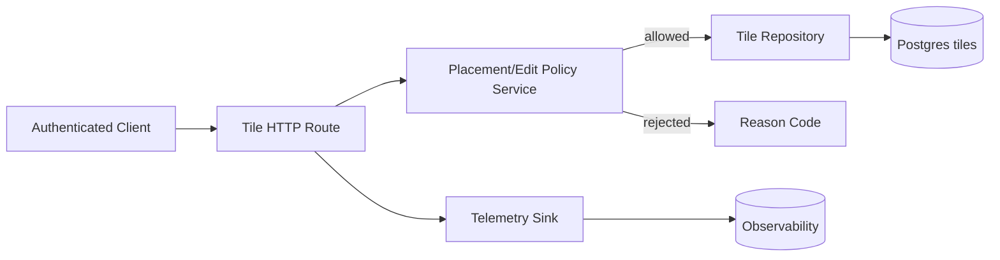

<!-- markdownlint-disable-file -->
# Task Research: Issue #14 Authoritative Placement and 10-Minute Self-Edit Window

Research implementation work for GitHub issue #14 in dkirby-ms/tile-fighter: establish server-authoritative tile placement and enforce a 10-minute self-edit window.

## Task Implementation Requests

* Determine current placement and edit flows across server/client and persistence layers.
* Define required changes to make placement authoritative and support a 10-minute creator self-edit window.
* Identify test impact and propose concrete implementation sequence.

## Scope and Success Criteria

* Scope: Analyze existing code paths in apps/server, apps/client, packages/shared-*, and tests; map issue requirements into implementation-ready tasks.
* Assumptions:
  * Issue #14 requires server-side enforcement, not client-only UX constraints.
  * Existing room/state/persistence architecture remains the foundation.
  * Time source should be trusted server time.
* Success Criteria:
  * Clear end-to-end behavior specification for authoritative placement + self-edit window.
  * One recommended technical approach with rationale and alternatives.
  * File-level change map with concrete test plan.

## Outline

1. Gather issue details and acceptance intent.
2. Analyze current placement/edit domain model, API routes, room handlers, and persistence schema.
3. Evaluate alternative enforcement strategies.
4. Select approach and provide implementation guidance.

## Potential Next Research

* Confirm issue policy details with maintainer.
  * Reasoning: Two core ambiguities remain: edit-window anchor and route/room command surface.
  * Reference: .copilot-tracking/research/subagents/2026-06-29/issue-14-intent-research.md
* Verify if telemetry naming should preserve persistence events in addition to story events.
  * Reasoning: Existing sink exposes tile_persisted/tile_persist_conflict; story requests tile_placed/tile_place_rejected/tile_edited.
  * Reference: apps/server/src/telemetry/telemetry-sink.ts:58-95, docs/layer1-backlog.md:141

## Research Executed

### File Analysis

* apps/server/src/http/app.ts
  * Middleware and route mounting order establishes where authoritative placement route should live.
* apps/server/src/http/routes/session.routes.ts
  * Existing request validation/rate-limit style and telemetry emission pattern.
* apps/server/src/http/auth-middleware.ts
  * Authenticated subject source for owner checks.
* apps/server/src/persistence/migrations/1720000000000_tiles.js
  * Existing ownership/timestamp/coordinate uniqueness constraints.
* apps/server/src/persistence/tile.repository.ts
  * Deterministic conflict handling and missing edit API.
* apps/server/src/telemetry/telemetry-sink.ts
  * Existing telemetry schema and tile persistence event wrappers.
* apps/server/tests/integration/tile-persistence.integration.test.ts
  * Existing placement conflict/read integration surface.
* apps/server/tests/unit/tile.repository.test.ts
  * Existing unit contract for insert/read/conflict behavior.
* apps/server/tests/integration/startup-migration.smoke.test.ts
  * Migration schema assertions to extend with edit metadata.
* packages/shared-types/src/index.ts
  * Shared contract surface does not include tile placement/edit DTOs.
* docs/layer1-backlog.md
  * Story-level acceptance and telemetry expectations for E2-S2.

### Code Search Results

* Search for tile write surface in server routes and room handlers.
  * No tile create/update endpoint or room message handler found.
* Search for shared tile DTOs.
  * No tile editability/ownership contracts in shared-types.
* Search for tile telemetry usage.
  * Tile persistence telemetry helpers exist; no current call sites in active flow.

### External Research

* GitHub issue review.
  * Source: https://github.com/dkirby-ms/tile-fighter/issues/14
  * Extracted requirements: authoritative placement, occupied rejection reason, deny self-edit after 10 minutes, per-account throttle, owner checks, telemetry events, and unit/integration/load tests.

### Project Conventions

* Standards referenced:
  * Route composition through factory functions and ordered middleware in apps/server/src/http/app.ts:22-31.
  * Deterministic route validation/error handling pattern in apps/server/src/http/routes/session.routes.ts:105-113 and 148-158.
  * Migration approach via node-pg-migrate JS files in apps/server/src/persistence/migrations and scripts in apps/server/package.json:14-15.
  * Layered tests: unit + integration + migration smoke + load harness.
* Instructions followed:
  * Task Researcher mode (research-only output under .copilot-tracking/research).

## Key Discoveries

### Project Structure

* Placement persistence primitives already exist:
  * tiles schema contains owner_id and created_at in apps/server/src/persistence/migrations/1720000000000_tiles.js:47-55.
  * coordinate uniqueness exists in apps/server/src/persistence/migrations/1720000000000_tiles.js:58-61.
* Runtime command surface for tile mutation does not exist yet:
  * no tile routes in apps/server/src/http/app.ts:22-31 and apps/server/src/http/routes/session.routes.ts:50-165.
  * no tile messages in room flow in apps/server/src/rooms/arena.room.ts:28-59.
* Shared contract gap:
  * packages/shared-types/src/index.ts:3-25 has no tile command/result DTOs.

### Implementation Patterns

* Auth principal is server-derived and available in res.locals.principal from apps/server/src/http/auth-middleware.ts:14-16.
* Repository returns discriminated union results for expected conflicts (coordinate_conflict) in apps/server/src/persistence/tile.repository.ts:32-34 and 106-115.
* Telemetry events use eventName + occurredAt + attributes in apps/server/src/telemetry/telemetry-sink.ts:3-7 and 19-23.
* Existing rate limiting in session routes uses in-memory key windows and 429 responses in apps/server/src/http/routes/session.routes.ts:13-43 and 148-158.

### Complete Examples

```ts
// Existing deterministic conflict style to preserve for placement/edit operations.
export type InsertTileResult =
  | { ok: true; tile: { id: number; createdAt: Date } }
  | { ok: false; reason: "coordinate_conflict"; error: TileConflictError };

// Source: apps/server/src/persistence/tile.repository.ts:32-34
```

### API and Schema Documentation

* Existing schema fields relevant to issue:
  * owner_id text not null
  * created_at timestamptz not null default now()
  * unique(region_id, cell_x, cell_y)
  * Source: apps/server/src/persistence/migrations/1720000000000_tiles.js:47-61
* Missing for edit flow:
  * no update method in repository and no update metadata fields in db type.
  * Source: apps/server/src/persistence/tile.repository.ts:40-53, apps/server/src/persistence/db.ts:13-25

### Configuration Examples

```json
{
  "telemetryEvents": [
    "tile_placed",
    "tile_place_rejected",
    "tile_edited"
  ],
  "existingTilePersistenceEvents": [
    "tile_persisted",
    "tile_persist_conflict"
  ]
}
```

## Technical Scenarios

### Scenario A: HTTP Authoritative Commands with Repository-Enforced Policy (Selected)

Implement placement and edit as authenticated HTTP commands under server routes, with domain/service policy checks and deterministic repository outcomes.

**Requirements:**

* Place tile on empty coordinate succeeds with acknowledgment.
* Place tile on occupied coordinate fails with occupied reason.
* Owner can edit own tile only within 10 minutes (server time).
* Non-owner edit denied.
* Per-account placement throttle present.
* Telemetry includes story events.

**Preferred Approach:**

* Add dedicated tile route module and service/repository methods for place/edit.
* Use created_at as authoritative 10-minute anchor.
* Keep coordinate immutability on edit (style-only edit), unless issue clarification changes this.

```text
apps/server/src/http/routes/tile.routes.ts                  (new)
apps/server/src/http/app.ts                                 (mount new routes)
apps/server/src/persistence/tile.repository.ts              (add update/edit methods)
apps/server/src/persistence/db.ts                           (add edit metadata type fields if used)
apps/server/src/persistence/migrations/<new>.js             (add additive columns if needed)
apps/server/src/telemetry/telemetry-sink.ts                 (add story telemetry helpers)
packages/shared-types/src/index.ts                          (tile command/result DTOs)
apps/server/tests/unit/tile.repository.test.ts              (edit-window + owner tests)
apps/server/tests/integration/tile-persistence.integration.test.ts (placement/edit e2e)
apps/server/tests/integration/startup-migration.smoke.test.ts      (new column assertions)
apps/server/tests/load/room-join-load.ts or new load file   (hotspot placement contention)
```



**Implementation Details:**

* Placement path
  * Validate body and principal from res.locals.principal.
  * Apply per-account in-memory throttle in route layer (align with session route style).
  * Insert via repository; map coordinate conflict to stable rejection payload.
  * Emit tile_placed or tile_place_rejected.
* Edit path
  * Lookup tile by coordinate or id, verify owner_id == principal tenantScopedSubject.
  * Compute now - created_at <= 10 minutes using server clock.
  * Reject with explicit reason on owner mismatch or window expiry.
  * Update mutable fields only; emit tile_edited on success.
* Persistence
  * Minimal path: derive window from created_at only; no schema change required for policy.
  * Recommended additive path: add updated_at and updated_by for audit/operability.
* Shared contracts
  * Add placement/edit request and result union types in packages/shared-types for client/server consistency.

```ts
// Proposed deterministic edit result shape to mirror existing repository style.
type UpdateTileResult =
  | { ok: true; tile: { id: number; updatedAt: Date | null } }
  | { ok: false; reason: "not_found" }
  | { ok: false; reason: "forbidden_owner_mismatch" }
  | { ok: false; reason: "edit_window_expired" };
```

### Scenario B: Colyseus Room Message Authoritative Commands (Not Selected)

Route placement/edit through room messages only.

**Why not selected:**

* Current room/state are combat-oriented and have no tile mutation model in apps/server/src/rooms/arena.state.ts:3-12 and apps/server/src/rooms/arena.room.ts:28-59.
* Would require larger architectural expansion and coupling before satisfying issue acceptance.
* Increases implementation scope relative to route-based pattern already used for authenticated commands.

### Scenario C: Client-Enforced Window with Server Best-Effort Validation (Rejected)

Rely on client timer/state for editability with minimal server checks.

**Why rejected:**

* Violates issue requirement for authoritative placement/edit policy.
* Client clocks and tampering risks would cause inconsistent enforcement.

## Selected Approach and Rationale

Selected approach: Scenario A (HTTP authoritative commands + server policy + deterministic repository results).

Rationale:

* Best fit for existing architecture and conventions:
  * Authenticated HTTP command flow already exists in apps/server/src/http/routes/session.routes.ts.
  * Repository conflict-union style already established in apps/server/src/persistence/tile.repository.ts.
* Delivers issue requirements with smallest cohesive change set.
* Supports clear unit/integration/load test coverage expected by story.

## Implementation Impact (Concrete Change Plan)

1. Add route surface.
   * Create apps/server/src/http/routes/tile.routes.ts.
   * Mount in apps/server/src/http/app.ts after auth middleware.
2. Add service/repository policy and persistence operations.
   * Extend apps/server/src/persistence/tile.repository.ts with update path and reason unions.
   * Optionally add migration + db type updates for updated_at/updated_by.
3. Extend telemetry sink.
   * Add tile_placed, tile_place_rejected, tile_edited helpers or direct emit conventions.
4. Add shared contracts.
   * Update packages/shared-types/src/index.ts with tile command/response DTOs.
5. Add tests.
   * Unit: owner/window boundary/not-found paths.
   * Integration: success + occupied + expired + non-owner denied.
   * Migration smoke: new columns/constraints if migration added.
   * Load: hotspot contention around occupied rejections and throttle behavior.

## Open Questions and Risks

* Window anchor ambiguity:
  * created_at-only vs reset-on-edit needs product clarification.
* Telemetry naming alignment:
  * whether to keep tile_persisted/tile_persist_conflict in parallel with story events.
* Throttle policy specificity:
  * exact window and limit are not specified in issue text.
* Error contract:
  * confirm stable reason/code mapping for client behavior.

## Evidence Register

* Issue requirements:
  * https://github.com/dkirby-ms/tile-fighter/issues/14
* Route and auth architecture:
  * apps/server/src/http/app.ts:22-31
  * apps/server/src/http/auth-middleware.ts:10-19
  * apps/server/src/http/routes/session.routes.ts:45-165
* Room and domain scope:
  * apps/server/src/rooms/arena.room.ts:28-59
  * apps/server/src/rooms/arena.state.ts:3-12
  * apps/server/src/domain/combat-simulation.service.ts:4-13
* Persistence and schema:
  * apps/server/src/persistence/migrations/1720000000000_tiles.js:47-61
  * apps/server/src/persistence/tile.repository.ts:32-157
  * apps/server/src/persistence/db.ts:13-25
* Telemetry:
  * apps/server/src/telemetry/telemetry-sink.ts:3-95
* Tests and load harness:
  * apps/server/tests/unit/tile.repository.test.ts:10-281
  * apps/server/tests/integration/tile-persistence.integration.test.ts:65-319
  * apps/server/tests/integration/startup-migration.smoke.test.ts:30-179
  * apps/server/tests/load/room-join-load.ts:160-226
* Story expectations:
  * docs/layer1-backlog.md:134-143

## Research Completion Status

* Primary research questions answered with implementation-ready recommendations.
* Remaining uncertainties are product-policy clarifications, not codebase discovery gaps.
