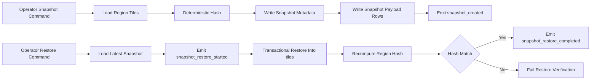

<!-- markdownlint-disable-file -->
# Task Research: story(layer1): E2-S3 region snapshot and replay recovery (Issue #15)

Research what is needed to implement GitHub Issue #15 in tile-fighter, including scope, code touch points, viable approaches, risks, and a recommended implementation path.

## Task Implementation Requests

* Analyze Issue #15 requirements and acceptance intent
* Identify impacted architecture/components in this repository
* Evaluate implementation alternatives and select one recommended approach
* Provide actionable implementation plan with tests and operational considerations

## Scope and Success Criteria

* Scope: Server-side region snapshot and replay recovery capabilities for layer1 story E2-S3, including data model, write/read flow, recovery integration, and testing strategy.
* Assumptions: Issue #15 is in the current repository and aligns with existing layer1 roadmap and persistence patterns.
* Success Criteria:
  * Requirements are traceable to concrete files and components in this codebase
  * A single recommended technical approach is selected with rationale
  * Implementation-ready steps and test matrix are documented

## Outline

1. Gather issue context and explicit requirements
2. Map existing architecture and relevant patterns
3. Evaluate technical scenarios and alternatives
4. Select approach and define implementation steps
5. Document risks, migrations, and verification strategy

## Potential Next Research

* Confirm JWT claim contract for operator role authorization
  * Reasoning: Replay command must be operator-only and claim shape is not yet explicit in current principal model
  * Reference: apps/server/src/http/auth-middleware.ts:4, packages/shared-types/src/index.ts:3
* Define initial retention policy for snapshot payload rows
  * Reasoning: Full snapshot copy improves recovery but can increase storage cost
  * Reference: apps/server/src/persistence/migrations/1720000000000_tiles.js:7
* Confirm concurrent write policy during restore
  * Reasoning: Region writes may require transactional locking semantics during replay restore
  * Reference: apps/server/src/http/routes/tile.routes.ts:103

## Research Executed

### File Analysis

* docs/layer1-backlog.md
  * E2-S3 requirements require immutable snapshot metadata, replay restore of latest consistent snapshot, post-replay hash verification, and telemetry events
  * Story includes operator-role restriction for replay command and dependency on E2-S2
* apps/server/src/rooms/arena.state.ts:3
  * Current room state is combat oriented and does not currently represent region snapshot state
* apps/server/src/persistence/migrations/1720000000000_tiles.js:7
  * Existing tile schema and region indexes provide persistence primitives needed for snapshot source and restore target
* apps/server/src/persistence/tile.repository.ts:208
  * Region reads already exist and can seed deterministic hash and snapshot payload creation
* apps/server/src/http/routes/session.routes.ts:50
  * Existing lifecycle/auth routes establish pattern for guarded server commands and telemetry emission
* apps/server/src/http/routes/tile.routes.ts:103
  * Tile place/edit endpoints confirm authoritative write path exists but no snapshot/replay route exists yet
* apps/server/src/telemetry/telemetry-sink.ts:15
  * Arbitrary event name emission is already supported for required E2-S3 events
* packages/shared-types/src/index.ts:3
  * Principal shape currently lacks explicit role semantics needed for operator-only replay authorization

### Code Search Results

* Query: snapshot_created|snapshot_restore_started|snapshot_restore_completed
  * No server implementation currently emits required E2-S3 snapshot telemetry events
* Query: snapshot|restore-latest|replay
  * No dedicated snapshot/replay repository, service, or route currently exists in apps/server/src
* Query: hash|checksum for region tiles
  * No existing deterministic region hash utility currently exists in apps/server/src

### External Research

* GitHub issue inspection: story(layer1): E2-S3 region snapshot and replay recovery (Issue #15)
  * Acceptance criteria align with docs/layer1-backlog.md story language and explicitly call out telemetry and operator-only replay restriction
  * Source: https://github.com/dkirby-ms/tile-fighter/issues/15

### Project Conventions

* Standards referenced: existing Kysely + node-pg-migrate persistence pattern, route-level auth middleware, telemetry sink event pattern, integration-first lifecycle tests
* Instructions followed: Task Researcher mode file-location constraints, dated research document convention, consolidation of subagent evidence into one primary file

## Key Discoveries

### Project Structure

* Server composition is layered around persistence, HTTP routes, session lifecycle, rooms, and telemetry in apps/server/src
* Layer1 tile persistence foundation already exists and is validated through migration and integration tests
* Snapshot/replay capability is currently absent and must be introduced as a new vertical slice spanning migration, repository, service, route, and tests

### Implementation Patterns

* Persistence-first pattern
  * Domain behavior is backed by explicit repositories and migrations, not implicit in-memory room state
* Route-driven orchestration pattern
  * HTTP routes validate/authorize, invoke services, and emit telemetry attributes
* Integration coverage pattern
  * New behavior is typically validated with targeted integration tests and smoke tests around startup/migration reliability

### Complete Examples

```ts
// Deterministic region hash sketch for snapshot metadata and post-restore verification.
import { createHash } from "node:crypto";

type TileRow = {
  regionId: string;
  cellX: number;
  cellY: number;
  offsetX: number;
  offsetY: number;
  shape: string;
  color: string;
  stylePayload: unknown;
  ownerId: string;
};

export function computeRegionHash(rows: TileRow[]): string {
  const normalized = [...rows]
    .sort((a, b) => (a.cellX - b.cellX) || (a.cellY - b.cellY))
    .map((r) => ({
      regionId: r.regionId,
      cellX: r.cellX,
      cellY: r.cellY,
      offsetX: r.offsetX,
      offsetY: r.offsetY,
      shape: r.shape,
      color: r.color,
      stylePayload: r.stylePayload,
      ownerId: r.ownerId,
    }));

  return createHash("sha256").update(JSON.stringify(normalized)).digest("hex");
}
```

### API and Schema Documentation

* Existing canonical tile schema and indexes
  * apps/server/src/persistence/migrations/1720000000000_tiles.js:7
* Existing region read APIs for materialization
  * apps/server/src/persistence/tile.repository.ts:208
* Existing telemetry API for event emission
  * apps/server/src/telemetry/telemetry-sink.ts:15

### Configuration Examples

```env
# Proposed snapshot replay tuning defaults (example)
SNAPSHOT_RETENTION_PER_REGION=10
SNAPSHOT_RESTORE_TIMEOUT_MS=30000
SNAPSHOT_HASH_ALGORITHM=sha256
```

## Technical Scenarios

### Region Snapshot and Replay Recovery Design

Issue #15 requires immutable snapshot metadata, replay restore of the latest consistent snapshot, and post-replay hash verification under operator-only command access. Current architecture already provides region tile persistence and lifecycle patterns, but lacks snapshot/replay orchestration primitives. The recommended design introduces a bounded full-snapshot model that can restore persisted region data, not only rematerialize runtime state.

**Requirements:**

* Snapshot trigger persists immutable metadata and immutable snapshot payload for a target region
* Replay restore loads latest consistent snapshot for region and restores region tile state transactionally
* Post-replay hash verification confirms restored state matches expected snapshot hash
* Required telemetry events are emitted with useful attributes
* Replay command path is restricted to operator role
* Integration, smoke, and ops-simulation coverage validates behavior and failure paths

**Preferred Approach:**

* Implement full snapshot copy using two new tables and a snapshot service boundary
* Use deterministic hash utility for both snapshot creation and restore verification
* Expose bounded admin route surface for snapshot trigger and restore-latest command
* Keep first pass synchronous but with clear service boundary to migrate to worker later

```text
apps/server/src/persistence/migrations/<new>_region_snapshots.js
apps/server/src/persistence/region-snapshot.repository.ts
apps/server/src/domain/region-snapshot.service.ts
apps/server/src/http/routes/snapshot.routes.ts
apps/server/src/http/app.ts
packages/shared-types/src/index.ts
apps/server/tests/integration/region-snapshot-replay.integration.test.ts
apps/server/tests/integration/region-restore-drill.smoke.test.ts
apps/server/tests/unit/region-snapshot.service.test.ts
```



**Implementation Details:**

* Data model
  * Add region snapshot metadata table with immutable row semantics
  * Add region snapshot payload table with immutable copied tile rows linked by snapshot id
* Service orchestration
  * Snapshot create path: read region rows, hash, insert metadata, bulk insert payload rows, emit telemetry
  * Restore path: fetch latest snapshot, emit start event, transactionally replace region rows in tiles, recompute hash, emit completion or fail
* Authorization
  * Extend principal mapping with operator claim interpretation and enforce in snapshot routes
* Telemetry
  * Emit required E2-S3 event names and include region_id, snapshot_id, tile_count, expected_hash, actual_hash, duration_ms
* Testing
  * Integration: creation immutability, restore correctness, hash verification, operator guard
  * Smoke/ops: drift simulation then restore drill

```ts
// Service boundary sketch for route usage.
export interface RegionSnapshotService {
  createSnapshot(input: { regionId: string; actorId: string }): Promise<{
    snapshotId: string;
    expectedHash: string;
    tileCount: number;
  }>;
  restoreLatest(input: { regionId: string; actorId: string }): Promise<{
    snapshotId: string;
    expectedHash: string;
    actualHash: string;
    restoredTileCount: number;
  }>;
}
```

#### Considered Alternatives

* Alternative A: metadata-only snapshot with deterministic replay from canonical tiles
  * Rejected for Issue #15 default recommendation because it cannot recover if canonical tiles data itself is corrupted/drifted
* Alternative C: event-sourced deltas with checkpoints
  * Rejected for current story scope due to complexity and broad architectural change beyond a Sprint 3 bounded implementation
* Selected Alternative B: full snapshot copy (metadata + immutable payload)
  * Chosen because it most directly satisfies restore predictability and post-replay verification with manageable incremental scope

## Selected Approach and Rationale

Selected approach is full snapshot copy with deterministic hash verification and operator-only restore command path.

Why this is the best fit now:

* Meets Issue #15 acceptance intent of predictable recovery from last consistent snapshot
* Reuses existing persistence architecture and migration/test conventions
* Preserves future option to evolve replay execution into an async worker without redesigning contracts

Implementation impact summary:

* Moderate server-side change across migration/repository/service/routes/tests
* Low client impact for first pass if command surface remains admin/operator only
* Clear observability via required snapshot telemetry events

## Actionable Next Steps for Implementation

1. Add migration and DB typings for region snapshot metadata and payload tables.
2. Implement region snapshot repository with create/load/restore operations and transactional restore.
3. Implement deterministic hash utility and region snapshot domain service.
4. Add operator-guarded snapshot routes and wire into HTTP app.
5. Extend principal typing/claim mapping for operator role decision.
6. Add required telemetry emissions and attributes.
7. Add unit/integration/smoke tests for snapshot creation, restore correctness, hash verification, and authz.

## Open Questions

* Which JWT claim is authoritative for operator role (for example roles, scp, custom claim)?
* What initial retention policy should be enforced per region?
* Should restore hard-block concurrent tile writes for the target region during replay?
