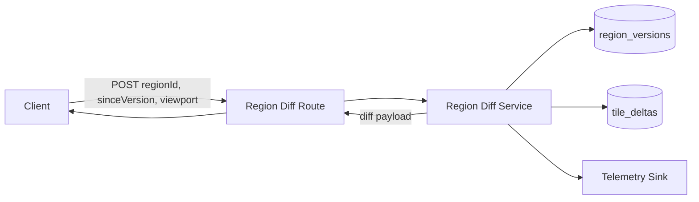

<!-- markdownlint-disable-file -->
# Task Research: Story (Layer1) E2-S4 Region Diff Retrieval API (Issue #16)

Research for implementing the region diff retrieval API requested in GitHub issue #16 for tile-fighter.

## Task Implementation Requests

* Analyze Issue #16 requirements and intent for a region diff retrieval API.
* Identify existing server persistence, domain, and HTTP patterns relevant to retrieval endpoints.
* Propose one recommended implementation approach with alternatives and rationale.
* Provide concrete implementation guidance, examples, and test strategy aligned to repository conventions.

## Scope and Success Criteria

* Scope: Investigation of current codebase and issue context for adding a read API that returns incremental region tile diffs for client viewport state sync.
* Assumptions:
  * Issue #16 is the primary source of truth for acceptance direction.
  * Existing migration/persistence shape can be extended if retrieval needs additional indexing/query forms.
  * Existing auth/session conventions must be preserved.
* Success Criteria:
  * Requirements for Issue #16 are explicitly captured and mapped to code areas.
  * At least two viable approaches are evaluated with trade-offs.
  * One selected approach includes endpoint contract, persistence query strategy, auth/error semantics, and test plan.
  * Evidence links include file paths with line numbers and/or external source URLs.

## Outline

1. Gather issue requirements and clarify expected retrieval behavior.
2. Analyze current persistence schema, repositories, and service boundaries for region snapshots/diffs.
3. Analyze HTTP route/auth patterns and response contract conventions.
4. Evaluate alternatives and select preferred implementation.
5. Produce actionable implementation checklist and test matrix.

## Potential Next Research

* Confirm delete semantics for diff payloads (tombstones required now vs deferred)
  * Reasoning: Data model and response schema differ substantially if deletions are in scope
  * Reference: apps/server/src/http/routes/tile.routes.ts:103
* Confirm viewport and payload hard limits
  * Reasoning: acceptance criteria require abuse controls but limits are not yet specified
  * Reference: dkirby-ms/tile-fighter issue #16 body
* Confirm authorization scope for diff reads (authenticated user vs room/region membership)
  * Reasoning: current auth middleware authenticates but does not enforce region membership
  * Reference: apps/server/src/http/auth-middleware.ts:61

## Research Executed

### File Analysis

* apps/server/src/http/app.ts
  * Auth middleware is mounted before protected/snapshot/tile/session routes, so diff route can follow same global auth model (apps/server/src/http/app.ts:33, apps/server/src/http/app.ts:37, apps/server/src/http/app.ts:127)
* apps/server/src/http/routes/tile.routes.ts
  * Existing command-style JSON POST routes with explicit payload guards and 400/409 mapping provide closest style template for diff route validation (apps/server/src/http/routes/tile.routes.ts:58, apps/server/src/http/routes/tile.routes.ts:103, apps/server/src/http/routes/tile.routes.ts:111, apps/server/src/http/routes/tile.routes.ts:127)
* apps/server/src/persistence/db.ts
  * Database typing currently includes tiles and snapshot tables only; no region version or tile delta tables exist yet (apps/server/src/persistence/db.ts:49, apps/server/src/persistence/db.ts:52, apps/server/src/persistence/db.ts:53)
* apps/server/src/persistence/tile.repository.ts
  * Repository can read full region/coordinates but has no since-version diff read path (apps/server/src/persistence/tile.repository.ts:208, apps/server/src/persistence/tile.repository.ts:223)
* apps/server/src/telemetry/telemetry-sink.ts
  * Telemetry sink supports emit + helper wrappers, but no tile_diff_requested or tile_diff_returned helpers are present (apps/server/src/telemetry/telemetry-sink.ts:15, apps/server/src/telemetry/telemetry-sink.ts:204)
* apps/server/tests
  * Existing integration and load patterns are present for auth/snapshot/join, but there is no diff-specific unit/integration/load coverage yet (apps/server/tests/integration/http-auth.integration.test.ts:17, apps/server/tests/integration/region-snapshot-replay.integration.test.ts:88, apps/server/tests/load/room-join-load.ts:26)

### Code Search Results

* Search term: region diff
  * No existing retrieval endpoint in apps/server/src/http/routes
* Search term: tile_diff_requested|tile_diff_returned
  * No existing telemetry events by those names in apps/server/src/telemetry/telemetry-sink.ts
* Search term: sinceVersion|version index
  * No persistence model for incremental region diff reads in apps/server/src/persistence

### External Research

* github-pull-request_issue_fetch: issue #16
  * Story requires viewport-scoped diff retrieval where unchanged version yields empty diff and stale version yields incremental updates
  * Source: https://github.com/dkirby-ms/tile-fighter/issues/16

### Project Conventions

* Standards referenced: markdown.instructions.md, writing-style.instructions.md, repository pattern conventions from server routes and tests
* Instructions followed: Task Researcher mode instructions, Markdown/frontmatter style guidance, research-only file scope

## Key Discoveries

### Project Structure

* HTTP composition is modular and route-file based under apps/server/src/http/routes, with shared app wiring in apps/server/src/http/app.ts
* Persistence uses Kysely and migration-driven schema evolution under apps/server/src/persistence/migrations
* Existing region snapshot capability provides replay/hash patterns but not incremental diff capability
* Shared contracts are centralized in packages/shared-types/src/index.ts and should host request/response contracts for cross-workspace typing

### Implementation Patterns

* Route pattern: parse/guard body, validate business constraints, map domain errors to HTTP status
* Auth pattern: middleware adds principal to res.locals and route-level checks handle authorization differences when needed
* Telemetry pattern: domain events are emitted through helper methods wrapping a common sink
* Test pattern: unit tests validate domain/service logic and integration tests assert API behavior via supertest

### Complete Examples

```ts
// Recommended request/response shape for POST /api/regions/diff
type RegionDiffRequest = {
  regionId: string;
  sinceVersion: number;
  viewport: {
    minCellX: number;
    maxCellX: number;
    minCellY: number;
    maxCellY: number;
  };
  maxTiles?: number;
};

type RegionDiffTileDelta = {
  cellX: number;
  cellY: number;
  offsetX?: number;
  offsetY?: number;
  shape?: string;
  color?: string;
  stylePayload?: unknown;
  ownerId?: string;
  version: number;
  operation: "upsert" | "delete";
};

type RegionDiffResponse = {
  ok: true;
  regionId: string;
  sinceVersion: number;
  currentVersion: number;
  nextSinceVersion: number;
  isEmpty: boolean;
  tiles: RegionDiffTileDelta[];
  truncated: boolean;
};
```

### API and Schema Documentation

* Current schema has tiles + snapshots but no diff index structures:
  * apps/server/src/persistence/migrations/1720000000000_tiles.js:59
  * apps/server/src/persistence/migrations/1730000000000_region_snapshots.js:7
* Proposed schema additions for issue #16:
  * region_versions(region_id PK, current_version bigint, updated_at timestamptz)
  * tile_deltas(id PK, region_id, version, cell_x, cell_y, operation, tile payload columns, changed_at)
  * indexes: (region_id, version), optional (region_id, cell_x, cell_y, version desc)

### Configuration Examples

```sql
create table region_versions (
  region_id text primary key,
  current_version bigint not null,
  updated_at timestamptz not null default now()
);

create table tile_deltas (
  id bigserial primary key,
  region_id text not null,
  version bigint not null,
  cell_x integer not null,
  cell_y integer not null,
  operation text not null,
  offset_x double precision,
  offset_y double precision,
  shape text,
  color text,
  style_payload jsonb,
  owner_id text,
  changed_at timestamptz not null default now()
);

create index tile_deltas_region_version_idx
  on tile_deltas(region_id, version);
```

## Technical Scenarios

### Region Diff Retrieval for Session Bootstrap/Recovery

Client submits region + viewport + sinceVersion. Server returns no data when current region version equals sinceVersion and returns incremental tile deltas when stale.

**Requirements:**

* Viewport request returns only relevant region tiles
* Unchanged version returns empty diff response
* Stale version returns incremental updates
* Request bounds and max payload constraints are enforced
* Telemetry emits tile_diff_requested and tile_diff_returned
* Test coverage includes unit assembler, integration versioned diff, and load read amplification

**Preferred Approach:**

* POST endpoint with region watermark version + append-only tile delta log
* Endpoint contract: POST /api/regions/diff
* Persistence model: region_versions + tile_deltas with transactional updates on tile mutation paths
* Diff assembly: read deltas since version, compact by coordinate (latest wins), enforce maxTiles and truncation flag

```text
apps/server/src/http/routes/region-diff.routes.ts               (new)
apps/server/src/domain/region-diff.service.ts                   (new)
apps/server/src/persistence/region-diff.repository.ts           (new) or extend tile.repository.ts
apps/server/src/persistence/migrations/<new>_region_diff.js     (new)
apps/server/src/persistence/db.ts                               (update)
apps/server/src/http/app.ts                                     (wire route)
apps/server/src/index.ts                                        (wire dependencies)
apps/server/src/telemetry/telemetry-sink.ts                     (new event helpers)
packages/shared-types/src/index.ts                              (shared contracts)
apps/server/tests/unit/region-diff.service.test.ts              (new)
apps/server/tests/integration/region-diff.integration.test.ts   (new)
apps/server/tests/load/region-diff-load.ts                      (new)
```



**Implementation Details:**

* HTTP layer:
  * Add route module with explicit request guard and validation for numeric bounds, viewport area, and maxTiles
  * Return 400 for malformed requests, 401 for unauthorized via existing middleware, and optional 429 if rate limiter is applied
* Domain layer:
  * Add RegionDiffService to orchestrate fast-path unchanged response and stale diff assembly
  * Include deterministic compaction rule for multiple updates to same cell in range
* Persistence layer:
  * Introduce region version watermark and append-only delta rows
  * Update tile write paths to increment version and append delta in same transaction
* Telemetry:
  * Add emitTileDiffRequested and emitTileDiffReturned helpers with attributes: region_id, since_version, current_version, viewport_area, tile_count, truncated, duration_ms
* Testing:
  * Unit: unchanged, stale updates, truncation, bounds rejection
  * Integration: auth, unchanged empty payload, stale incremental payload
  * Load: repeated stale-read behavior to track read amplification profile

```ts
// Core decision logic for service layer
if (sinceVersion === currentVersion) {
  return {
    ok: true,
    regionId,
    sinceVersion,
    currentVersion,
    nextSinceVersion: currentVersion,
    isEmpty: true,
    tiles: [],
    truncated: false
  };
}

const deltas = await repo.getTileDeltasSince({
  regionId,
  sinceVersion,
  viewport,
  maxTiles
});

return assembleDiffResponse(regionId, sinceVersion, currentVersion, deltas, maxTiles);
```

#### Considered Alternatives

* Alternative A: GET /api/regions/:regionId/diff?sinceVersion=...&viewport=...
  * Rejected because query complexity is higher and less aligned with existing POST JSON command/query style in this codebase
* Alternative B: POST hash-gated full viewport read without delta log
  * Rejected because it does not satisfy incremental stale-update acceptance criteria and risks read amplification
* Selected: POST /api/regions/diff with region version watermark + tile delta log
  * Selected because it satisfies all acceptance criteria, supports abuse controls, and matches existing route/persistence patterns
