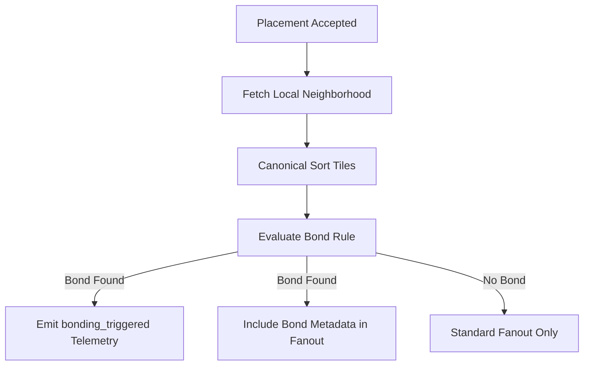

<!-- markdownlint-disable-file -->
# Task Research: Epic E4 Deterministic Bonding Engine and E4-S1

Research for Epic E4 (deterministic bonding engine and visual effects) with a focused deep dive on Task 1 (E4-S1) in the tile-fighter repository.

## Task Implementation Requests

* Research Epic E4 scope, risks, and implementation implications.
* Research Task 1 (E4-S1) requirements, likely code touchpoints, and a recommended implementation path.

## Scope and Success Criteria

* Scope: Repository-backed research for epic requirements, existing architecture fit, determinism risks, performance constraints, and test strategy for E4 and E4-S1.
* Assumptions:
  * Task 1 maps to story E4-S1 listed in the epic issue.
  * Story-level details may exist in backlog/docs or need derivation from epic scope.
  * Existing server authoritative simulation architecture should remain source of truth for deterministic outcomes.
* Success Criteria:
  * Epic and task scope translated into implementable technical plan.
  * One selected approach for E4-S1 with rationale and alternatives.
  * Concrete file-level references and test additions identified.

## Outline

1. Confirm E4 and E4-S1 intent from repository artifacts.
2. Map existing simulation and state update pathways.
3. Identify deterministic bonding implementation options.
4. Define test strategy and acceptance gates.
5. Select one implementation approach for E4-S1.

## Potential Next Research

* Confirm adjacency model details (4-neighbor vs 8-neighbor vs pattern windows) with product owner or issue discussion for strict rule interpretation.
  * Reasoning: Prevents rule drift before implementation and protects determinism claims.
  * Reference: docs/layer1-backlog.md
* Decide package boundary for bonding domain logic (extend shared-types vs dedicated shared package) with maintainers.
  * Reasoning: Reduces refactor churn as E4-S2/E4-S4 expand scope.
  * Reference: packages/shared-types/src/index.ts

## Research Executed

### File Analysis

* docs/layer1-backlog.md
  * Defines epic E4 scope and E4-S1 acceptance criteria for `glow-chain`, `blend-gradient`, and `pulse-rhythm` rules (docs/layer1-backlog.md:35, docs/layer1-backlog.md:249).
* .copilot-tracking/github-relationships.md
  * Maps E4 to stories #21-#24 and marks E4-S1 as blocker for E4-S2 and E4-S4 (.copilot-tracking/github-relationships.md:23, .copilot-tracking/github-relationships.md:74).
* apps/server/src/persistence/tile.repository.ts
  * Contains authoritative placement write path and region/delta persistence, suitable as source for neighborhood input (apps/server/src/persistence/tile.repository.ts:241).
* apps/server/src/http/app.ts
  * Placement success path already fans out realtime updates; best hook to emit bonding outcomes (apps/server/src/http/app.ts:196).
* apps/server/src/domain/combat-simulation.service.ts
  * Demonstrates deterministic payload hashing pattern that can be mirrored for bonding evaluation discipline (apps/server/src/domain/combat-simulation.service.ts:35).
* apps/server/src/domain/region-hash.ts
  * Canonical deterministic ordering and hashing patterns already in use (apps/server/src/domain/region-hash.ts:43).
* apps/server/src/domain/region-diff.service.ts
  * Deterministic diff ordering/compaction patterns useful for stable bond event ordering (apps/server/src/domain/region-diff.service.ts:91).
* packages/shared-types/src/index.ts
  * No existing bonding event/type surface; requires extension for E4-S1 (packages/shared-types/src/index.ts:84, packages/shared-types/src/index.ts:195).
* apps/server/src/telemetry/telemetry-sink.ts
  * No `bonding_triggered` telemetry method currently (apps/server/src/telemetry/telemetry-sink.ts:98).
* apps/server/tests/unit/region-diff.service.test.ts
  * Demonstrates deterministic unit test pattern (apps/server/tests/unit/region-diff.service.test.ts:137).
* apps/server/tests/integration/placement-conflict-resolution.integration.test.ts
  * Provides integration pattern for deterministic conflict flows (apps/server/tests/integration/placement-conflict-resolution.integration.test.ts:119).
* apps/server/tests/load/placement-conflict-hotspot.load.ts
  * Existing load harness suitable for adjacency hotspot regressions (apps/server/tests/load/placement-conflict-hotspot.load.ts:117).

### Code Search Results

* `E4-S1|bond|glow|blend|pulse`
  * Story and rule corpus found in docs/layer1-backlog.md.
* `deterministic|hash|canonical|sort`
  * Determinism primitives found in region hash/diff services and combat simulation hashing.
* `telemetry|placement_`
  * Telemetry events exist for placement lifecycle but not bonding-specific method.

### External Research

* None. Repository artifacts were sufficient for this phase.

### Project Conventions

* Standards referenced: deterministic ordering for simulation artifacts and canonical hashing patterns in existing domain services.
* Instructions followed: Task Researcher mode constraints, repository-first evidence gathering, and research artifact path constraints under `.copilot-tracking/research/`.

## Key Discoveries

### Project Structure

* Server authority path: placement commit and region delta persistence live in `apps/server/src/persistence` and HTTP fanout in `apps/server/src/http/app.ts`.
* Shared contract path: cross-app types live in `packages/shared-types/src/index.ts`.
* Regression/testing structure: unit, integration, and load suites exist in `apps/server/tests/*` and client deterministic checksum tests in `apps/client/tests/unit`.

### Implementation Patterns

* Determinism pattern: explicit sorting plus canonical serialization/hashing before comparison.
* Integration pattern: authoritative server write followed by deterministic fanout payload generation.
* Testing pattern: reorder-invariance and repeated-run equivalence assertions for deterministic behavior.

### Complete Examples

```ts
type BondType = 'glow-chain' | 'blend-gradient' | 'pulse-rhythm';

type BondInputTile = {
  x: number;
  y: number;
  color: string;
};

export function evaluateBondType(
  placed: BondInputTile,
  neighborhood: readonly BondInputTile[],
): BondType | null {
  // Deterministic evaluation depends on canonical neighborhood order.
  const sorted = [...neighborhood].sort((a, b) => (a.y - b.y) || (a.x - b.x));

  // Placeholder logic shape based on E4-S1 rule corpus.
  if (sorted.some((n) => n.color === placed.color)) {
    return 'glow-chain';
  }

  return null;
}
```

### API and Schema Documentation

* Existing placement response contracts do not include bond data.
* Region diff transport contract currently models tile deltas only.
* E4-S1 requires introducing a bond contract surface if emitted to clients.

### Configuration Examples

```json
{
  "telemetry": {
    "method": "bonding_triggered",
    "dimensions": ["region_id", "bond_type", "x", "y"]
  }
}
```

## Technical Scenarios

### Deterministic Bonding Rule Execution for E4-S1

E4-S1 should introduce a pure, deterministic bonding evaluator that runs in the authoritative placement success flow. The evaluator consumes the placed tile and a bounded neighborhood, returns one of three bond types (`glow-chain`, `blend-gradient`, `pulse-rhythm`) or null, and emits telemetry plus optional payload metadata using stable ordering.

**Requirements:**

* Deterministic rule outcomes under repeated runs.
* Local neighborhood recalculation with controlled performance.
* Hooks for visual effects and reduced motion compatibility.

**Preferred Approach:**

* Add a shared pure evaluator in `packages/shared-types` now, invoke it server-side on successful placement, and emit deterministic bond outcomes via telemetry/fanout.

```text
packages/shared-types/src/index.ts                    (add bond types + evaluator exports)
apps/server/src/http/app.ts                           (invoke evaluator in placement success path)
apps/server/src/persistence/tile.repository.ts        (bounded neighborhood retrieval helper)
apps/server/src/telemetry/telemetry-sink.ts           (add bonding_triggered telemetry)
apps/server/tests/unit/bonding-evaluator.test.ts      (new deterministic rule corpus tests)
apps/server/tests/integration/tile-bonding-trigger.integration.test.ts (new integration)
```



**Implementation Details:**

* Use canonical tile ordering before evaluation or event emission to prevent runtime iteration nondeterminism.
* Keep evaluator pure and side-effect free for stable unit testing and future client reuse.
* Prefer bounded (local) neighborhood query in repository helper to avoid region-scale scans.
* Add integration test asserting identical outputs across repeated/reordered execution inputs.

```ts
const bondType = evaluateBondType(placedTile, neighborhoodTiles);

if (bondType) {
  telemetry.recordBondingTriggered({
    regionId,
    bondType,
    x: placedTile.x,
    y: placedTile.y,
  });
}
```

#### Considered Alternatives

* Server-only evaluator in `apps/server/src/domain`.
  * Rejected: fastest to ship but duplicates logic later and diverges from shared module intent.
* Shared evaluator in `packages/shared-types`.
  * Selected: best speed-to-delivery while preserving deterministic reuse across server/client.
* New dedicated package (for example `packages/shared-bonding`).
  * Rejected for now: cleanest long-term boundary but adds setup and CI overhead for E4-S1 timeline.
* Client-only evaluator.
  * Rejected: breaks server-authoritative determinism goals and weakens regression guarantees.
